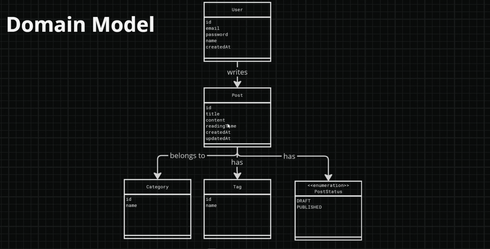
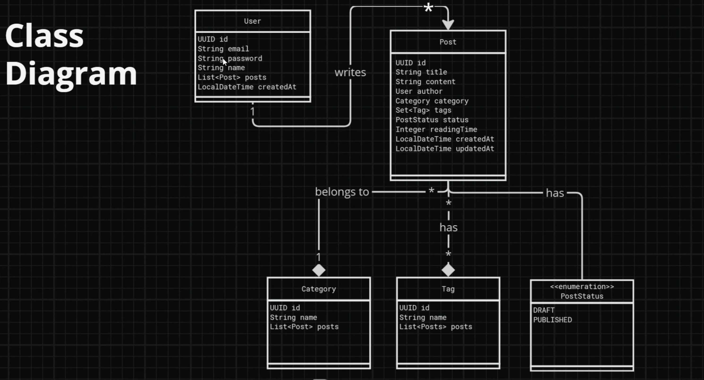
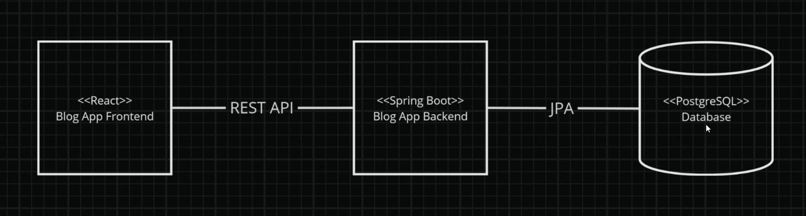
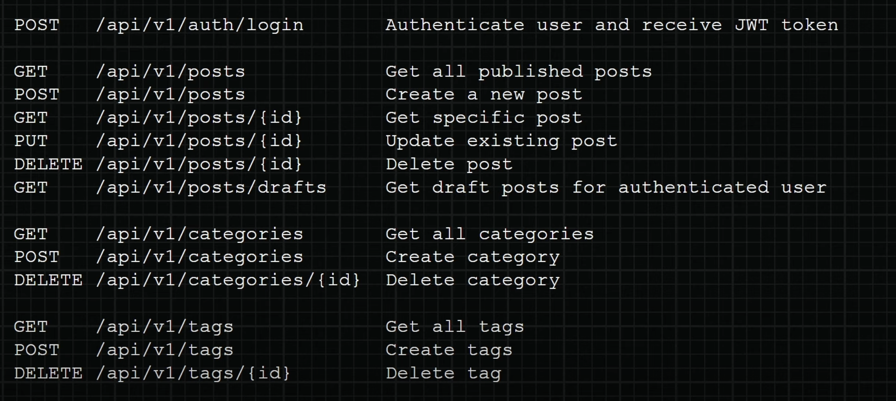

# 🚀 Java Blog App

This repository is a step-by-step journey through building a secure and efficient RESTful API using **Spring Boot** and **Spring Security**. The project is designed to help me (and others) understand how to streamline API development, implement best practices, and apply robust security measures.

## Create a new Project

Generate your Spring Boot project via [start.spring.io](https://start.spring.io) with the following settings:

### Project Settings
- **Project:** Maven | **Language:** Java | **Java:** 21 | **Boot Version:** 3.4.0
- **Group:** `com.devtiro` | **Artifact/Name:** `blog`
- **Package:** `com.devtiro.blog` | **Packaging:** JAR
- **Description:** A blog platform

### Dependencies
Click **"Add Dependencies"** and select:
Got it! Here's the updated table with two dependencies per row:

| Dependency         | Purpose                                |
|--------------------|----------------------------------------|
| Spring Web         | REST API support                       |
| Spring Data JPA    | ORM & persistence                      |
| PostgreSQL Driver  | Connect to PostgreSQL database         |
| Spring Security    | Authentication & authorization         |
| Lombok             | Reduces boilerplate code               |
| Validation         | Enables bean validation                |
| H2                 | In-memory database for testing         |

---

## Project Overview



The `domain model diagram` helps us to see how the different enties in the project are related, what kind of attributes does each domain have and how are they going to communicate with each other.



The `class model diagram` has additional information like the relationships, datatypes of each attribute.

## Architecture Overview



## Rest API Design



---
## Running the Database
We'll set up a PostgreSQL database using Docker Compose, which will serve as the persistent
data store for our blog.

This containerized approach ensures consistency across development environments and simplifies
database management.

#### Create a new file named `docker-compose.yml`

```dockerfile
services:
  db:
    # PostgreSQL database
    image: postgres:latest
    ports:
      - "5442:5432"
    restart: always
    environment:
      POSTGRES_PASSWORD: Amey1234!
      POSTGRES_USER: amey
      POSTGRES_DB: blog_db

  adminer:
    image: adminer:latest
    restart: always
    ports:
      - "8888:8080"
```

- Run the command
```bash 
docker-compose up -d
```

## Connecting to Database

#### Add this in `application.properties`
```
spring.application.name=blog

# Database Connection
spring.datasource.url=jdbc:postgresql://localhost:5442/blog_db
spring.datasource.username=amey
spring.datasource.password=Amey1234!

# JPA Configuration
spring.jpa.hibernate.ddl-auto=update
spring.jpa.show-sql=true
spring.jpa.properties.hibernate.format_sql=true
spring.jpa.properties.hibernate.dialect=org.hibernate.dialect.PostgreSQLDialect
```
--- 
## MapStruct Configuration

MapStruct is a tool that automatically creates code to convert data between different formats like DTOs and Domain Entities. Instead of manually writing this conversion code, MapStruct does it for you during the build process, making it faster and safer. It avoids using slow methods that reflect on the data. Since it works well with tools like Lombok and Spring, it’s a great choice for our blog project. We'll set it up now and explore how to use it later.

### Add the Dependency