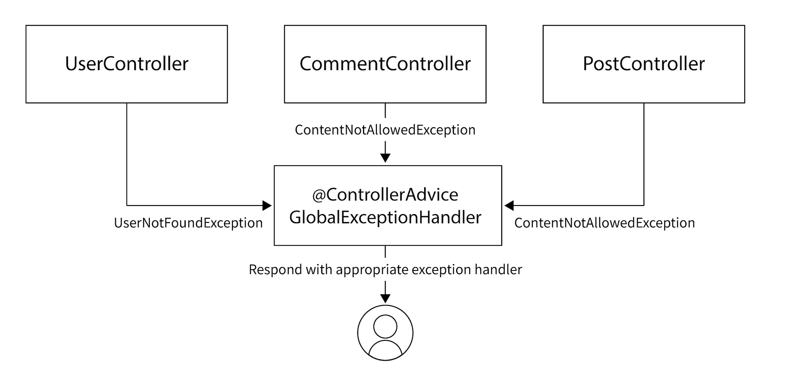

# 🚀 Java Blog App

This repository is a step-by-step journey through building a secure and efficient RESTful API using **Spring Boot** and **Spring Security**. The project is designed to help me (and others) understand how to streamline API development, implement best practices, and apply robust security measures.

## Create a new Project

Generate your Spring Boot project via [start.spring.io](https://start.spring.io) with the following settings:

### Project Settings
- **Project:** Maven | **Language:** Java | **Java:** 21 | **Boot Version:** 3.4.0
- **Group:** `com.devtiro` | **Artifact/Name:** `blog`
- **Package:** `com.devtiro.blog` | **Packaging:** JAR
- **Description:** A blog platform

### Dependencies
Click **"Add Dependencies"** and select:
Got it! Here's the updated table with two dependencies per row:

| Dependency         | Purpose                                |
|--------------------|----------------------------------------|
| Spring Web         | REST API support                       |
| Spring Data JPA    | ORM & persistence                      |
| PostgreSQL Driver  | Connect to PostgreSQL database         |
| Spring Security    | Authentication & authorization         |
| Lombok             | Reduces boilerplate code               |
| Validation         | Enables bean validation                |
| H2                 | In-memory database for testing         |

---

## Project Overview


The `domain model diagram` helps us to see how the different enties in the project are related, what kind of attributes does each domain have and how are they going to communicate with each other.


The `class model diagram` has additional information like the relationships, datatypes of each attribute.

## Architecture Overview


## Rest API Design


---
## Running the Database
We'll set up a PostgreSQL database using Docker Compose, which will serve as the persistent
data store for our blog.

This containerized approach ensures consistency across development environments and simplifies
database management.

#### Create a new file named `docker-compose.yml`

```dockerfile
services:
  db:
    # PostgreSQL database
    image: postgres:latest
    ports:
      - "5442:5432"
    restart: always
    environment:
      POSTGRES_PASSWORD: Amey1234!
      POSTGRES_USER: amey
      POSTGRES_DB: blog_db

  adminer:
    image: adminer:latest
    restart: always
    ports:
      - "8888:8080"
```

- Run the command
```bash 
docker-compose up -d
```

## Connecting to Database

#### Add this in `application.properties`
```
spring.application.name=blog

# Database Connection
spring.datasource.url=jdbc:postgresql://localhost:5442/blog_db
spring.datasource.username=amey
spring.datasource.password=Amey1234!

# JPA Configuration
spring.jpa.hibernate.ddl-auto=update
spring.jpa.show-sql=true
spring.jpa.properties.hibernate.format_sql=true
spring.jpa.properties.hibernate.dialect=org.hibernate.dialect.PostgreSQLDialect
```
--- 
## MapStruct Configuration

MapStruct is a tool that automatically creates code to convert data between different formats like DTOs and Domain Entities. Instead of manually writing this conversion code, MapStruct does it for you during the build process, making it faster and safer. It avoids using slow methods that reflect on the data. Since it works well with tools like Lombok and Spring, it’s a great choice for our blog project. We'll set it up now and explore how to use it later.

### Adding Dependencies

Add MapStruct and Lombok dependencies to your `pom.xml`:

```xml
<properties>
    <org.mapstruct.version>1.6.3</org.mapstruct.version>
    <lombok.version>1.18.36</lombok.version>
</properties>

<dependencies>
    <dependency>
        <groupId>org.mapstruct</groupId>
        <artifactId>mapstruct</artifactId>
        <version>${org.mapstruct.version}</version>
    </dependency>
</dependencies>
```

### Configuring Compiler Plugin

Configure the Maven compiler plugin to work with MapStruct and Lombok:

```xml
<build>
    <plugins>
        <plugin>
            <groupId>org.apache.maven.plugins</groupId>
            <artifactId>maven-compiler-plugin</artifactId>
            <configuration>
                <annotationProcessorPaths>
                    <path>
                        <groupId>org.projectlombok</groupId>
                        <artifactId>lombok</artifactId>
                        <version>${lombok.version}</version>
                    </path>
                    <path>
                        <groupId>org.mapstruct</groupId>
                        <artifactId>mapstruct-processor</artifactId>
                        <version>${org.mapstruct.version}</version>
                    </path>
                    <path>
                        <groupId>org.projectlombok</groupId>
                        <artifactId>lombok-mapstruct-binding</artifactId>
                        <version>0.2.0</version>
                    </path>
                </annotationProcessorPaths>
            </configuration>
        </plugin>
    </plugins>
</build>
```

Now, MapStruct is set up and ready to generate DTOs when needed.

## Entity Creation

First things first, we will create all the entities required for the project. These entities will be placed in the **`models`** package.

Later, we'll also create the corresponding DTOs (Data Transfer Objects) to handle data transfer and mapping between the entities.

### Basic Annotations

### 1. **`@Entity`**
Marks a class as a JPA entity, mapping it to a database table.

### 2. **`@Table`**
Specifies the table name in the database for the entity.
```java
@Table(name = "blogs")
```

### 3. **`@Getter` & `@Setter`**
Automatically generates getter and setter methods for class fields.

### 4. **`@Builder`**
Generates a builder pattern to easily create instances of the class.

### 5. **`@Id`**
Marks the primary key field of the entity.

### 6. **`@GeneratedValue`**
Specifies how the primary key value will be generated (e.g., auto-increment).

### 7. **`@Column`**
Defines the attributes for a column (e.g., length, nullable, unique).
```java
@Column(length = 100, nullable = false, unique = true)
private String title;
```

### 8. `@PrePersist` Annotation
The @PrePersist annotation is used in JPA entities to mark a method that should be executed before an entity is persisted (saved) into the database. This is part of the entity lifecycle, and the method annotated with @PrePersist is triggered automatically when the EntityManager's persist() method is called.

Automatically set timestamps like createdAt or updatedAt without needing to manually assign values each time


---

## Entity Relationships in JPA

#### 1. **@OneToOne**

Maps a one-to-one relationship between two entities.\
Example: A user has one profile.

#### 2. **@OneToMany**

Maps a one-to-many relationship.\
Example: A user can have multiple blog posts.

#### 3. **@ManyToOne**

The inverse of `@OneToMany`.\
Example: Each blog post belongs to one user.

#### 4. **@ManyToMany**

Maps a many-to-many relationship.\
Example: A post can have many tags, and each tag can belong to many posts.
---
### `FetchType.LAZY` vs `EAGER`

- **`LAZY`** (default for collections): Data is **loaded only when accessed**.
- **`EAGER`**: Data is **loaded immediately** with the parent entity.

Using `LAZY` helps improve performance by avoiding unnecessary database hits.

```java
@OneToMany(mappedBy = "user", fetch = FetchType.LAZY)
private List<Post> posts;
```

---

### `@JoinColumn`

Used to customize the foreign key column in a relationship.

```java
@JoinColumn(name = "user_id", nullable = false)
private User user;
```

This will create a column named `user_id` in the child table referencing the parent `User`.

---

#### `cascade`

Defines operations that should be automatically passed from parent to child.
Common types:

- `CascadeType.ALL`: All operations (persist, merge, remove, etc.)
- `CascadeType.PERSIST`: Child is saved automatically with parent
- `CascadeType.REMOVE`: Child is deleted when parent is deleted

```java
@OneToMany(cascade = CascadeType.ALL)
private List<Comment> comments;
```

#### `orphanRemoval = true`

Automatically deletes child entities if they are removed from the parent collection.

```java
@OneToMany(cascade = CascadeType.ALL, orphanRemoval = true)
private List<Comment> comments;
```

---
### `@ManyToMany`

Maps a **many-to-many** relationship between two entities.

📌 **Example**:\
A `Post` can have many `Tags`, and a `Tag` can be associated with many `Posts`.

```java
@ManyToMany
@JoinTable(
    name = "post_tags",
    joinColumns = @JoinColumn(name = "post_id"),
    inverseJoinColumns = @JoinColumn(name = "tag_id")
)
private Set<Tag> tags = new HashSet<>();
```

&#x20;**What's happening here?**

- JPA creates a **join table** (`post_tags`) with foreign keys referencing both `Post` and `Tag`.
- This table connects the many-to-many relationship.


---

## Creating Repositories

To handle database operations, we'll use **Spring Data JPA Repositories**.

### Step-by-step

1. **Create a new package**:\
   Inside your project, create a package named:

   ```
   com.ameyTech.blog.repository
   ```

2. **Create interfaces for each entity**:
   Each interface extends `JpaRepository<EntityName, IDType>`.\
   Example for a `Post` entity with `Long` as ID:

   ```java
   public interface UserRepository extends JpaRepository<Post, Long> {
   }
   ```

3. **Spring Boot auto-implements** these interfaces at runtime, so you don’t need to write boilerplate code for basic CRUD operations.

---

## REST API Endpoint Creation

This section outlines how to create API endpoints in a layered Spring Boot application using Controllers, Services, and Mappers.

---

### Creating the Controller

Controllers handle incoming HTTP requests and return appropriate responses.

**Steps:**

1. Create a `controllers` package.
2. Use `@RestController` to mark the class as a REST controller.
3. Use `@RequestMapping("/api/v1/...")` to define the base URL.
4. Inject the service and mapper using `@RequiredArgsConstructor`.

**Example:**

```java
@RestController
@RequestMapping("/api/v1/categories")
@RequiredArgsConstructor
public class CategoryController {
    private final CategoryService categoryService;
    private final CategoryMapper categoryMapper;

    @GetMapping
    public ResponseEntity<List<CategoryDto>> listCategories() {
        return ResponseEntity.ok(
            categoryService.listCategories()
                           .stream()
                           .map(categoryMapper::toDto)
                           .toList()
        );
    }
}
```

**Annotations:**

- `@RestController`: Defines the class as a REST controller.
- `@RequestMapping`: Sets base route for all methods.
- `@GetMapping`: Handles GET HTTP requests.
- `@RequiredArgsConstructor`: Lombok generates constructor for required dependencies.

---

### Creating the Service

Services contain business logic and interact with repositories.

**Steps:**

1. Create a `services` package and an interface for the service.
2. Create an `impl` subpackage for the implementation.
3. Use `@Service` for the implementation class.

**Example:**

```java
public interface CategoryService {
    List<Category> listCategories();
}
```

```java
@Service
@RequiredArgsConstructor
public class CategoryServiceImpl implements CategoryService {
    private final CategoryRepository categoryRepository;

    @Override
    public List<Category> listCategories() {
        return categoryRepository.findAllWithPostCount();
    }
}
```

### Using Mappers

A **Mapper** is used to convert one object type to another — commonly from an **Entity** (used in DB) to a **DTO** (used in API responses), and vice versa.

---

### Why do we need it?

- Entities often contain extra data that we don't want to expose in APIs.
- DTOs are cleaner and safer to send as API responses.
- Manually converting entities to DTOs is repetitive and error-prone.
- **MapStruct** helps automate this conversion with minimal code.

---

### How to Use MapStruct

#### 1. Create a DTO
#### 2. Create a Mapper Interface
#### 3. Use the Mapper in Controller

### Key Mapstruct Annotations

#### 🔍 `@Mapper(componentModel = "spring", unmappedTargetPolicy = ReportingPolicy.IGNORE)`

This is a **MapStruct** annotation that turns the interface into a mapper class. Here's what each part means:

- **`componentModel = "spring"`**:  
  This tells MapStruct to generate the mapper as a **Spring bean** so you can `@Autowired` or `@RequiredArgsConstructor` inject it like any other Spring component.

- **`unmappedTargetPolicy = ReportingPolicy.IGNORE`**:  
  If some fields in the target class (like `CategoryDto`) are not mapped explicitly, this setting prevents MapStruct from throwing warnings or errors. It just ignores unmapped fields silently.


#### `@Mapping(target = "postCount", expression = "java(calculatePostCount(category.getPosts()))")`

This maps a field from the source (`Category`) to the target (`CategoryDto`).

---

## Centralized Error Handling in Spring `@ControllerAdvice`

In real-world apps, different types of errors can occur (bad requests, server issues, etc.).\
**Centralized error handling** ensures all errors are caught uniformly and meaningful responses are sent to the frontend.

---



| Annotation          | Purpose                                                             |
| ------------------- | ------------------------------------------------------------------- |
| `@ControllerAdvice` | Marks this class as a **global error handler** for all controllers. |
| `@RestController`   | Ensures **responses are JSON** (instead of error HTML pages).       |
| `@ExceptionHandler` | Tells Spring **which method handles which exception type**.         |
| `@Slf4j`            | Enables **logging errors** to help in debugging.                    |

---

### Important Classes:

1. **ErrorController** (`@RestController`, `@ControllerAdvice`)

    - Catches all exceptions using methods annotated with `@ExceptionHandler`.
    - Returns a `ResponseEntity<ApiErrorResponse>` with appropriate HTTP status and error message.
    - Logs the exception (`log.error()`).

2. **ApiErrorResponse** (DTO Class)

    - Defines the standard error response structure.
        - `status` → HTTP code
        - `message` → Description of the error
        - `errors` → (Optional) Field-level errors

---

### Key Points:

- `handleException(Exception ex)`\
  → **Generic Catch**: If no specific handler is found, returns 500 Internal Server Error.

- `handleIllegalArgumentException(IllegalArgumentException ex)`\
  → **Specific Handler**: For custom errors like duplicate category names, returns 400 Bad Request.


---

## Adding Spring Security

Now that category management and error handling are in place, we'll **secure** the app to allow **public viewing** but **restrict modifications**.

---

### Why Security?

- Allow users to **read posts freely**.
- Restrict **create/update/delete** to **authenticated users**.
- Prepare the app for **user login** and **JWT authentication**.

---

### Add These Dependencies (pom.xml):

```xml
<!-- Spring Security -->
<dependency>
    <groupId>org.springframework.boot</groupId>
    <artifactId>spring-boot-starter-security</artifactId>
</dependency>

<!-- JWT Support -->
<dependency>
    <groupId>io.jsonwebtoken</groupId>
    <artifactId>jjwt-api</artifactId>
    <version>0.11.5</version>
</dependency>
<dependency>
    <groupId>io.jsonwebtoken</groupId>
    <artifactId>jjwt-impl</artifactId>
    <version>0.11.5</version>
    <scope>runtime</scope>
</dependency>
<dependency>
    <groupId>io.jsonwebtoken</groupId>
    <artifactId>jjwt-jackson</artifactId>
    <version>0.11.5</version>
    <scope>runtime</scope>
</dependency>
```

---

### After Adding:

- All endpoints are **protected** by default.
- We'll later **customize** security to allow **public GETs** and **protected POST/PUT/DELETE**.

---

## JWT auth
